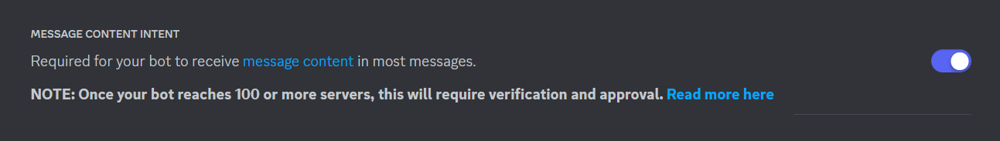

# discord-bot-2-template
A template for my future bots.

### Prerequisites

- Create a bot on [Discord Developer Portal — My Applications](https://discord.com/developers/applications)

- **You would need MESSAGE CONTENT INTENT in your bot page set as `ON`**

  

  While most other stuff can be left disabled, way too many functions (mentions, DMs, etc) rely on this. My advice: just leave it enabled.

### Code setup

1. ~~I think I don't need to write this but still~~
   
    ```bash
    git clone
    cd discord-bot-2-template
    # python -m venv venv
    ```
    
2. Create a `.env` file in the root directory, `.env.example` is provided as a template.
    ```bash
    cp .env.example .env
    # modify .env as needed
    ```

3. Install dependencies and run:

    ```bash
    pip install -r requirements.txt
    python ./main.py
    ```
    
4. If you want to, check [this tutorial](assets/docs/discord_bot_tutorial.md)

### TODOs

- message sending queue for slow mode
  - maybe check `kafka`...maybe.
- background loop that runs timed stuff (e.g. countdowns)
- *tbc*


### Credits

- [discord.py](https://discordpy.readthedocs.io/en/stable/)
- [discord.py official examples](https://github.com/Rapptz/discord.py/tree/master/examples)
- [Random GPT bot that I used as my 1st bot template](https://github.com/Zero6992/chatGPT-discord-bot)
- [python - How do i make a working slash command in discord.py - Stack Overflow](https://stackoverflow.com/questions/71165431/how-do-i-make-a-working-slash-command-in-discord-py)

~~probably will have even more copy-pasta from other bot templates/tutorials in the future~~