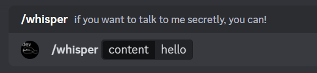
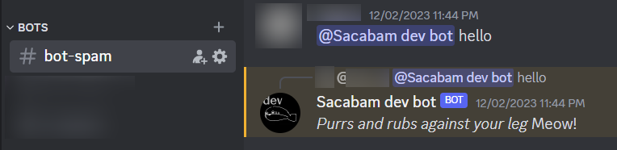
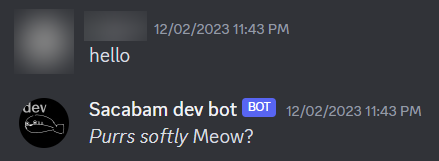

# How to make a Discord bot

(using this template)

for someone who's never made one before

### Prerequisites

[Check the readme](../../Readme.md) on how to prep your code env, and how to run the basic bot.

Check the `Basic Concepts` part in `discord.py`\'s official docs, it explains how user interactions are registered/listened from the dev's perspective: [Introduction (discordpy.readthedocs.io)](https://discordpy.readthedocs.io/en/latest/intro.html#basic-concepts)

### Add new functions

##### Figuring out UX

Before you code your discord part, figure out how you want to present your function to the user. Common ones include:

- Slash commands (most intuitive for devs, recommended starting point)

  

  [python - How do i make a working slash command in discord.py - Stack Overflow](https://stackoverflow.com/questions/71165431/how-do-i-make-a-working-slash-command-in-discord-py)

- Mentioning the bot

  

- DMs / direct messages

  *It's *NOT* recommended to make bots respond to all messages (including messages in servers), as that would easily flood your servers.

  

You can add UI and more user-friendly stuff, such as `Button` or `Modal`, but they will require one of the interactions above to be initiated, making them slightly more complicated.

`discord.py` has official examples for both, [button example](https://github.com/Rapptz/discord.py/blob/master/examples/views/confirm.py) | [modal example](https://github.com/Rapptz/discord.py/blob/master/examples/modals/basic.py)

Whichever UX you choose, all these things above would internally register as [events](https://discordpy.readthedocs.io/en/latest/intro.html#basic-concepts). The recommended place to define each event would be `src/bot.py`, which I separated from `src/client.py` to centralize event management.

##### Connecting stuff to backend

Once you decided on your user-side interaction, you would want to handle the event, possibly in a separate function.

It's more of an architectural problem than anything else to decide where to put your back-end functions. I'll list the available options, but it's up to you to decide where you want to put them.

- in `client.py` - particularly useful if you want to use stored states within the bot
- separately, similar to `utils/message.py`
- in `bot.py` *(NOT recommended)* - I separated `bot` from `client` to avoid mixing up user interactions and internal operations within the bot.

### Code explanations (and samples)

- `src/client.py` is a subclass of `Discord.Client`, making it a "discord bot". If you want any variables/internal functions, specific to the bot, this is a good place to add them.
  - `src.client.SingletonClient` is another viable implementation. It's unused in this case.
- `src/bot.py` takes an instance of `src/client.py`, and adds user interaction endpoints to it using [event decorators](https://discordpy.readthedocs.io/en/latest/api.html#event-reference). The `Client` is then returned, so that it can be started in `main.py`.
  - `on_ready()` includes some basic startup. While Discord officially says it's not guaranteed to run, and can run multiple times, I'd say it's okay to start logging/sync commands to your testing server here.
  - `on_message()` is called on any type of message - DMs/mentions/your friends chatting, all of them. Flags such as `is_dm` are included, to allow you to define specific reactions.
  - `help()`, `echo()`, and anything that has the `@client.tree.command` decorator is a slash command
    - `@client.tree` also has another type of interaction - see [official examples](https://github.com/Rapptz/discord.py/blob/master/examples/app_commands/basic.py)
- `src/ui/` includes some UI samples that I made. `src/bot.py` includes slash commands as endpoints to try them.

And a bit of misc stuff...

- `utils/message.py` includes a function that splits long strings into segments. It exists because discord limits messages to 2000 characters.
- `utils/logger.py` includes a logger. it will write everything (including stuff from `discord.py`) to `logs/discord.log`.

### Useful docs

[Welcome to discord.py (discordpy.readthedocs.io)](https://discordpy.readthedocs.io/en/latest/index.html)

[discord.py/examples at master · Rapptz/discord.py (github.com)](https://github.com/Rapptz/discord.py/tree/master/examples)
